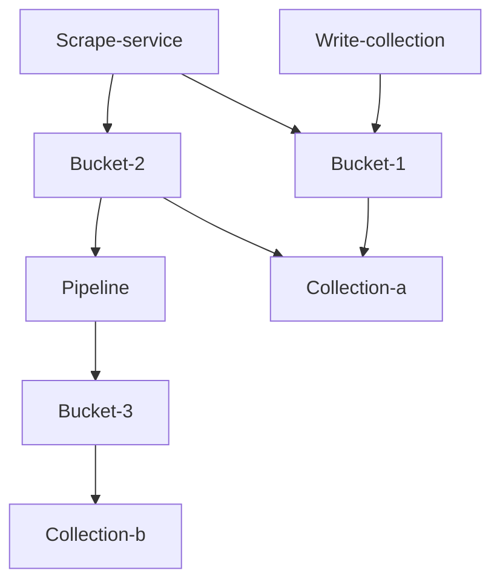
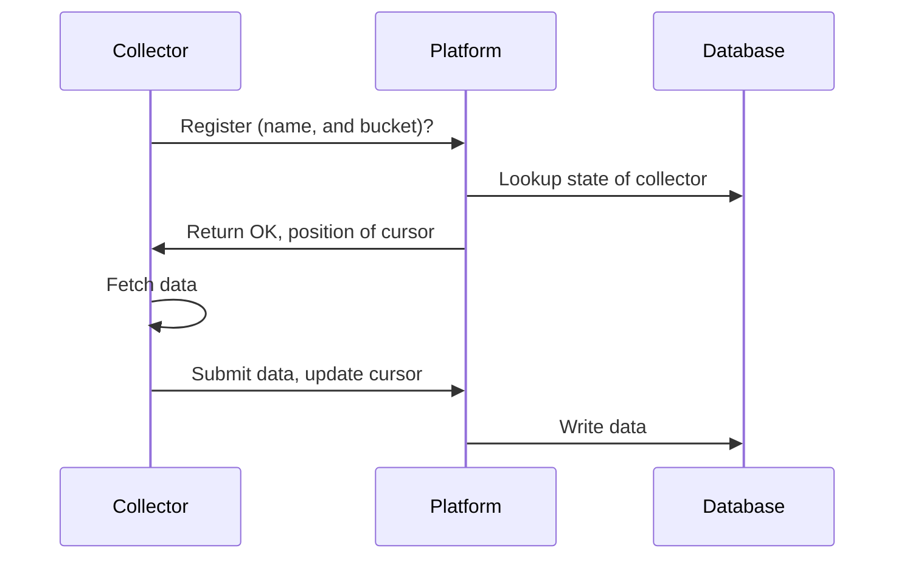

# STIXHub

STIXHub is a platform for collecting and distributing Cyber Threat Intelligence (CTI) in STIX format. The platform includes a fully compliant TAXII server for receiving and distributing CTI. 

The platform also features a system for filtering and mutating CTI, to automate and improve data quality. 

## Philosophy
STIX and TAXII are the most widely accepted standards for CTI. They are vendor agnostic, and machine readable, enabling rapid integration with products and quick exchange of information. 

They are however not perfect protocols, especially TAXII is lacking in features prohibiting wide spread adoption. Aside from implementing TAXII, this platform also includes a TAXII+ server. An implementation which adds or changes features in TAXII. TAXII+ is meant to experiment to learn how to improve the TAXII standard.

TAXIIHub should be simple to deploy and maintain. Implementing modern software development and operations practices. 

## Extendability
The main functionality of the platform is store and distribute STIX via TAXII. However the platform should be extendable. Other ingestion systems may be implemented, to interface with popular systems such as MISP.


## Primary features
- Scrape TAXII servers for new intelligence
- Store scaped intelligence in 'buckets'
- Expose stored intelligence via TAXII collections
- Configure TAXII collections via config as code that support filters and RBAC
- Move and mutate data between 'buckets'
- Simple RBAC system

# Development roadmap

Phase 1:
- Read and write collections
- Only single node deployment

Phase 2:
- Collector service
- Multi node deployment

Phase 3:
- Single node pipelines

Phase 4:
- Multi node pipelines

# Design
This section details the system design of TAXIIHub. The system is built of 4 main components:
- Data is scraped by the **scrape service** from other TAXII servers
- Data is stored and organized into **buckets**
- Data is moved, filtered and/or mutated between buckets by **pipelines**
- TAXII read collections for reading source their data from buckets
- TAXII write collections for data submitted to the server



### Limitations
- TAXII collections cannot be both read and write
- Buckets which have the scrape service as input cannot also have a pipeline as input.
- The system can scale horizontally, but the pipeline system must be deployed separately to support multiple workers.

## Storage
This section details how the storage is laid out.

### Buckets
Buckets are used to organize data within the storage layer of TAXIIHub. When intelligence is ingested, the new entities can be written to one or multiple buckets. When distributing intelligence, collections can source intelligence from one or multiple buckets. 

A bucket can be configured to store data in two ways. Either it merges entities with the same ID according to one of multiple merge strategies (Merge mode), or multiple entities with the same ID can coexist in the same bucket (Raw mode). 

### Merge strategies

### RBAC
There is a simple role based access control system. The platform has users, who can have roles. Roles givess access to read or write collections. This means that RBAC is not implemented on an entity specific level. This is a conscious choice to simplify the RBAC model. An RBAC model which is easy to understand and to reason about decreases the chance of making mistakes in configuring it. In turn preventing accidental data leaks. 

```Mermaid
  graph TD;
  User-->Role;
  Role--"Grants access to"-->Bucket
  Collection--"uses"-->Bucket
```

An example configuration may be as follows:
```Mermaid
  graph TD;
  User-->Role-a;

  Role-a--"Grants access to"-->Bucket-a
  Role-a--"Grants access to"-->Bucket-b

  Collection-a--"uses"-->Bucket-a
  Collection-a--"uses"-->Bucket-b
  Collection-b--"uses"-->Bucket-b
  Collection-b--"uses"-->Bucket-c
```
In this example user a has access to both collection-a and collection-b. However, while can read all entities in collection-a, they can only read entities from bucket-b in collection-b, because their role does not grant them access to bucket-c.

## Collector
A collector is responsible for collecting data from another TAXII server (or other protocols) and inserting them into a bucket. Collectors communicate with the system via a HTTP/s rest API. When a connector starts, it registers itself to to the platform, and indicate to which bucket it wants to write. The default behaviour is that the platform provisions an new bucket for each collector. However you can configure the collector to write to another bucket.

The collector submits entities to the system by HTTP/s. The system writes them to the configured bucket. 



## Pipelines
Each pipeline is executed by a worker. The worker periodically checks the database to see if new entities have arrived in a bucket. If they have, the worker processes them, and writes them to another bucket. The pipeline worker uses the database to keep track of where it is in the bucket. 

Each pipeline can be driven by multiple workers. The system supports a single node deployment, but also a mode in which the workers are split out in a different context.

### Pipeline capabilities
A pipeline can perform the following actions on an entity
- Filter based on properties
  - Exact string match
  - Value occurs in list
  - Integer match
  - Integer higher/lower/equal
- Merge into bucket (Deduplication)

Pipelines run on new data in buckets, but can be triggered to reprocess old data.

### Managing deduplication conflicts
Workers constantly poll the database to check for new entities. When writing to a bucket, they are capable of performing an upsert. Effectively merging the data according to a specific strategy. When multiple workers are active, the system needs to manage them to prevent a deduplication conflict scenario. 

We require that STIX Id's are generated deterministically. This is achieved by overwriting the ID with the ID generated by our own system on ingestion, and keeping the old ID in a separate field

#### Single node deployment
When the system is deployed in single node. Each worker is a FastAPI worker(?). At startup each node is given a partition based on a hash partitioning scheme. This partition determines which entities it may pick up from the database, ensuring that entities that share the same ID (and would be deduplicated) are always processed by the same process. When increasing or decreasing the amount of workers for a pipeline, the system must be completely restarted to allow repartioning of workers. 

#### Multi node deployment
The partioning scheme works identically. However workers register themselves to an API. The worker must receive the go ahead from the API before starting work.

```Mermaid
    graph TD;
    Worker-register-event-->Worker-stop-event-->Repartition-event-->Restart-run-event
```