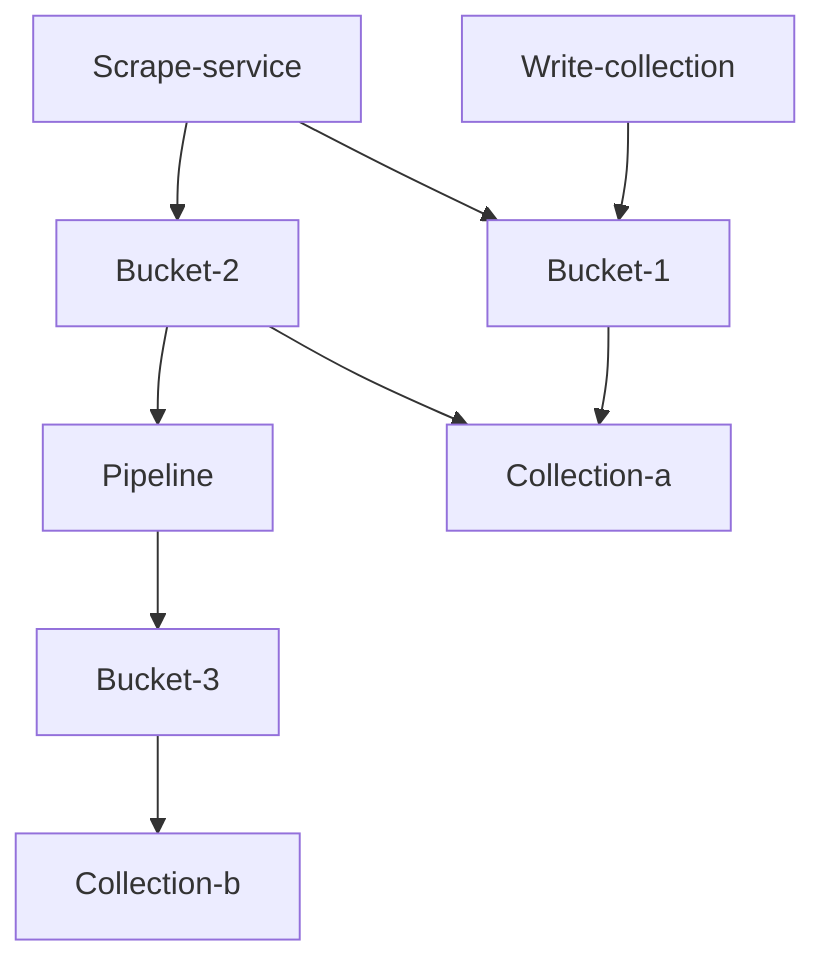
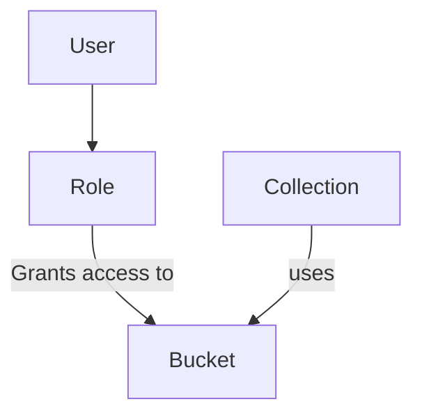
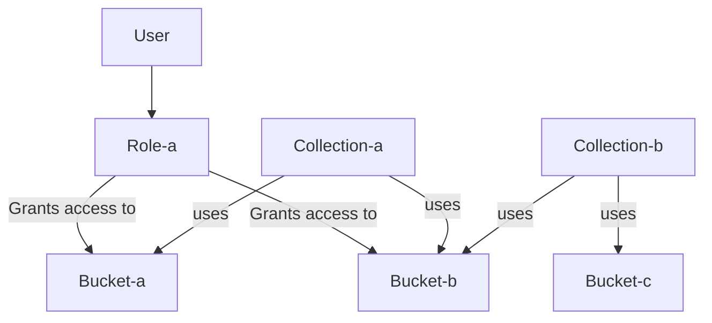
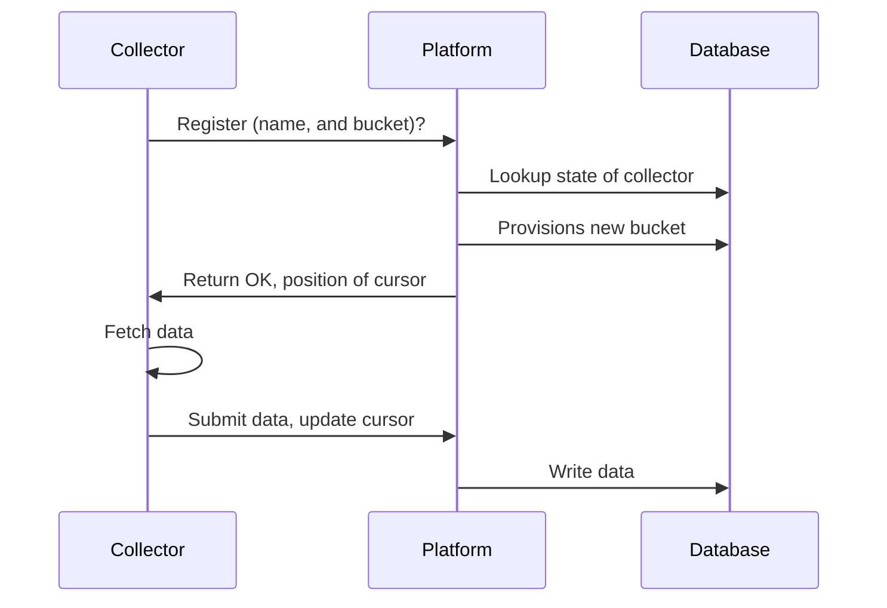

# STIXHub

STIXHub is a platform for collecting and distributing Cyber Threat Intelligence (CTI) in STIX format. The platform includes a fully compliant TAXII server for receiving and distributing CTI. 

The platform also features a system for filtering and mutating CTI, to automate and improve data quality. 

# Features
STIXHub is currently not production ready, but does already support a number of useful features: \
\
:white_check_mark: TAXII 2.1 compatible endpoints \
:white_check_mark: Writing to collections \
:white_check_mark: Reading from collections \
:white_check_mark: Storage system driven by the bucket design \
:white_check_mark: Append only buckets

**The following features are planned:**\
\
:heavy_exclamation_mark: Bucket merge mode for deduplication\
:heavy_exclamation_mark: User management and RBAC on buckets\
:heavy_exclamation_mark: Collector service to read external TAXII 2.1 endpoints\
:heavy_exclamation_mark: Collector service to read external MISP endpoints\
:heavy_exclamation_mark: Pipelines to move and transform data between buckets\
:heavy_exclamation_mark: Multi node deployments to enable horizontal scaling

**Possible features:** \
\
:question: External buckets to outsource entity processing\
:question: CSV exporter for easy integration with legacy systems \
:question: Frontend for exploring data \
:question: Frontend for enabling human driven workflows (triaging and labelling intelligence) \
:question: MCP integration for enabling agent driven workflows (triaging and labelling intelligence) \

# Getting started
## Docker deploy
## Development environment

## Philosophy
STIX and TAXII are the most widely accepted standards for CTI. They are vendor agnostic, and machine readable, enabling rapid integration with products and quick exchange of information. 

They are however not perfect protocols, especially TAXII is lacking in features prohibiting wide spread adoption. Aside from implementing TAXII, this platform also includes a TAXII+ server. An implementation which adds or changes features in TAXII. TAXII+ is meant to experiment to learn how to improve the TAXII standard.

TAXIIHub should be simple to deploy and maintain. Implementing modern software development and operations practices. 

## Extendability
The main functionality of the platform is store and distribute STIX via TAXII. However the platform should be extendable. Other ingestion systems may be implemented, to interface with popular systems such as MISP.

## Primary features
- Scrape TAXII servers for new intelligence
- Store scaped intelligence in 'buckets'
- Expose stored intelligence via TAXII collections
- Configure TAXII collections via config as code that support filters and RBAC
- Move and mutate data between 'buckets'
- Simple RBAC system

# Design
This section details the system design of TAXIIHub. The system is built of 4 main components:
- Data is scraped by the **scrape service** from other TAXII servers
- Data is stored and organized into **buckets**
- Data is moved, filtered and/or mutated between buckets by **pipelines**
- TAXII read collections for reading source their data from buckets
- TAXII write collections for data submitted to the server

### Limitations
- TAXII collections cannot be both read and write
- Buckets which have the scrape service as input cannot also have a pipeline as input.
- The system can scale horizontally, but the pipeline system must be deployed separately to support multiple workers.

## Storage
This section details how the storage is laid out.

### Buckets
Buckets are used to organize data within the storage layer of TAXIIHub. When intelligence is ingested, the new entities can be written to one or multiple buckets. When distributing intelligence, collections can source intelligence from one or multiple buckets. 

### Merge modes & strategies
A bucket can be configured to store data in two ways. Either it merges entities with the same ID according to one of multiple merge strategies (Merge mode), or multiple entities with the same ID can coexist in the same bucket (Append mode). You may wish to use merge mode, when writing to a bucket which is used directly in a collection. This prevents your consumers from receiving conflicting information on the same entity. Append mode make sense for a bucket used for collection. In this case you may want to keep all version of an entity, so you can merge them and reprocess them again later.

When merging, the following modes are supported:
- Merge with priority based on creation date
- Merge with priority based on update date
- Merge with priority based on TLP
- Merge with priority based on confidence
- Replace with priority based on creation date
- Replace with priority based on update date
- Replace with priority based on TLP
- Replace with priority based on confidence

The difference between replacing and merging is that the former completely replaces sub elements such as label lists, while merging combines them. 

### RBAC
There is a simple role based access control system. The platform has users, who can have roles. Roles give access to read or write collections. This means that RBAC is not implemented on an entity specific level. This is a conscious choice to simplify the RBAC model. An RBAC model which is easy to understand and to reason about decreases the chance of making mistakes in configuring it. In turn preventing accidental data leaks. If you want to share an entity with a user, you'll have to write it to a collection they can access.

An example configuration may be as follows:

In this example user a has access to both collection-a and collection-b. However, while can read all entities in collection-a, they can only read entities from bucket-b in collection-b, because their role does not grant them access to bucket-c.

## Collector
A collector is responsible for collecting data from another TAXII server (or other protocols) and inserting them into a bucket. Collectors communicate with the system via a HTTP/s rest API. When a connector starts, it registers itself to to the platform, and indicate to which bucket it wants to write. The default behaviour is that the platform provisions a new bucket for each collector. However you can configure the collector to write to another bucket.

The collector submits entities to the system by HTTP/s. The system writes them to the configured bucket. 

## Pipelines
Each pipeline is executed by a worker. The worker periodically checks the database to see if new entities have arrived in a bucket. If they have, the worker processes them, and writes them to another bucket. The pipeline worker uses the database to keep track of where it is in the bucket. 

Each pipeline can be driven by multiple workers. The system supports a single node deployment, but also a mode in which the workers are split out in a different context.

### Pipeline capabilities
A pipeline can perform the following actions on an entity
- Filter based on properties
  - Exact string match
  - Value occurs in list
  - Integer match
  - Integer higher/lower/equal
- Merge into bucket (Deduplication)

Pipelines run on new data in buckets, but can be triggered to reprocess old data.

### Locking mechanism
Workers constantly poll the database to check for new entities. When writing to a bucket, they are capable of performing an upsert. Effectively merging the data according to a specific strategy. When multiple workers are active, the system needs to manage them to prevent a deduplication conflict scenario. 

We require that STIX Id's are generated deterministically. This is achieved by overwriting the ID with the ID generated by our own system on ingestion, and keeping the old ID in a separate field. The system uses the update skip locked mechanism in PSQL to prevent race conditions

#### Fetching from queue
Workers get entities from the bucket, which is essentially functioning as a queue. Each entity has a state attached to it. New->Pending->Processed. When selecting entities from the bucket, the connector locks them immediately to prevent other workers from processing the same entities.

#### Writing to output bucket
Depending on the bucket mode, writing happens differently. If the bucket is in 'append' mode the new entity can just be inserted. If the bucket is in 'merge' mode, we need to take care to prevent race conditions. It may occur that two different workers have picked up two entities with the same ID but different conflicting fields. Assuming that the order in they are merged does not matter, we must ensure that one is not accidentally overwriting the other. This can happen in two instances: when a new entity is inserted, but the other worker inserts a conflicting entity before that. Alternatively the entity is already in the bucket, one worker merges their updates, and the second worker overwrites these updates with their own.

The first scenario is solved by failing the insert when an entity is already in the bucket, and performing a merge instead. The second scenario is solved by locking the existing entity into merge mode, and having the worker fail with NO_WAIT when trying to get a lock. The worker will then wait for a period, and try to merge again.